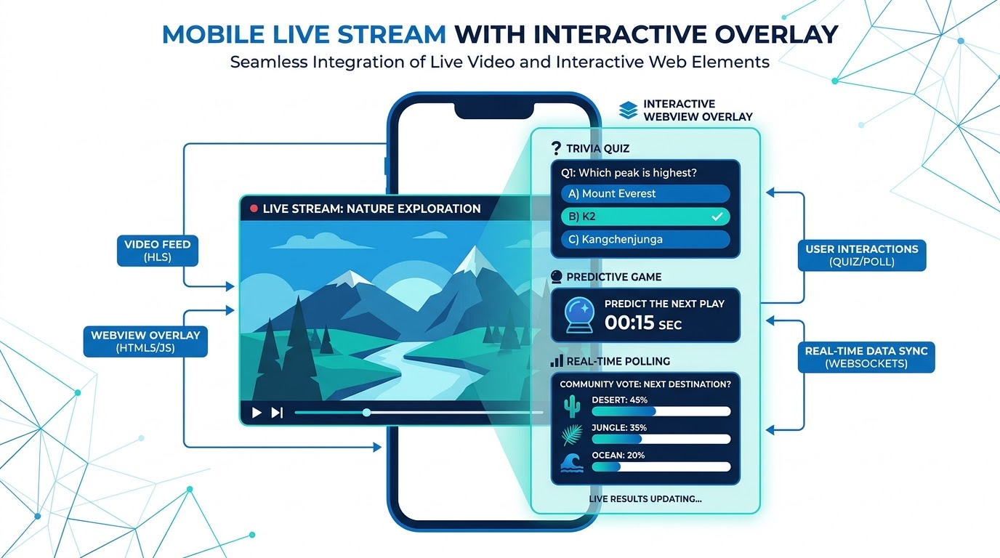
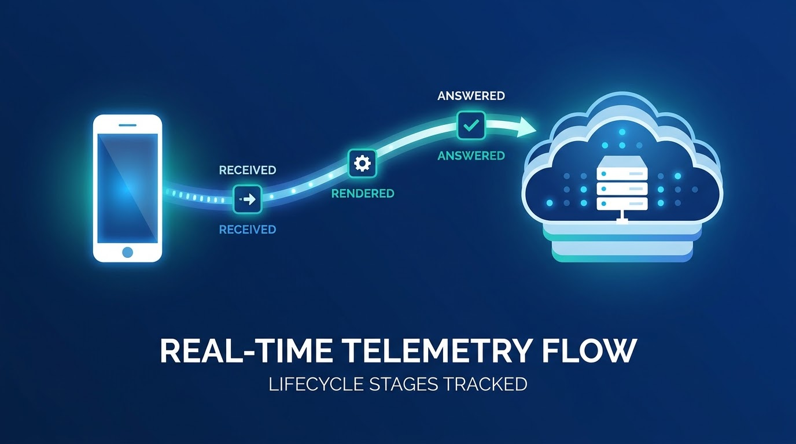

## 1. GIỚI THIỆU DỰ ÁN

### 1.1. Dự án là gì
**SDK Interactive Overlay** là giải pháp phần mềm dạng thư viện di động tích hợp (được đóng gói dưới dạng tệp **AAR** dành cho hệ điều hành Android và **XCFramework** dành cho iOS). Bộ thư viện này chịu trách nhiệm hiển thị các lớp phủ nội dung tương tác (overlay) viết bằng nền tảng Web và đè trực tiếp lên trình phát video (Video Player) của ứng dụng chủ (host app).

SDK đóng vai trò là một lớp Facade điều phối trung gian duy nhất, quản lý kết nối thời gian thực, xử lý các logic nghiệp vụ kiểm tra phân quyền người dùng và thực hiện cầu nối dữ liệu hai chiều giữa hệ thống máy chủ, ứng dụng native gốc và giao diện Web (Web Template) hiển thị.



### 1.2. Mục đích dự án
*   **Tách biệt thiết kế giao diện khỏi mã nguồn gốc (Native Code)**: SDK không trực tiếp vẽ các thành phần câu hỏi hay trò chơi tương tác phức tạp mà nạp các đường dẫn URL Web Template vào các WebView trong suốt. Cơ chế này cho phép nhà vận hành thay đổi hoàn toàn thiết kế giao diện, cấu hình minigame hoặc kịch bản tương tác trực tiếp từ trang quản trị (CMS) mà không yêu cầu người dùng cuối phải cập nhật phiên bản ứng dụng trên Google Play hay App Store.
*   **Đồng bộ hóa tương tác thời gian thực với luồng video**: Cung cấp khả năng hiển thị các lớp phủ đồng bộ theo tiến trình phát của luồng video trực tiếp (LIVE) thông qua kết nối Socket.IO bảo mật, hoặc đồng bộ theo tiến trình phát của video theo yêu cầu (VOD) bằng cách so khớp thời gian phát tính bằng giây do ứng dụng host bơm vào.
*   **Tăng cường khả năng kiếm tiền (Monetization)**: Tích hợp sâu các luồng phân quyền tương tác dựa trên trạng thái hội viên Fanclub hoặc kiểm tra trạng thái thuê bao VIP của nhà mạng viễn thông (VIP Telco) để tự động quyết định cho phép người dùng tham gia tương tác miễn phí hoặc hiển thị Dialog xác nhận đặt cược/trừ xu OnG đối với người dùng thông thường.
*   **Quan trắc hiệu năng hiển thị và hành vi người dùng**: Tự động hóa quá trình đo đạc hiệu suất và vòng đời của một lớp phủ thông qua cơ chế gửi sự kiện kiểm tra chất lượng kết xuất (`emit-ack`) về máy chủ vận hành. Cơ chế này giúp đội ngũ quản trị nắm rõ tỷ lệ tiếp cận thực tế của quảng cáo hoặc minigame trên thiết bị đầu cuối của người dùng.

### 1.3. Đối tượng sử dụng tài liệu
*   **Lập trình viên phát triển ứng dụng di động (Mobile App Developers)**: Những người trực tiếp tích hợp bộ SDK này vào ứng dụng xem truyền hình/phát video trực tuyến trên iOS (yêu cầu từ iOS 15.0 trở lên) và Android (yêu cầu từ Android API 21 trở lên).
*   **Lập trình viên phát triển Web Template**: Những người xây dựng các kịch bản minigame, bảng khảo sát, hay vòng quay may mắn chạy trên môi trường Web, kết nối thông tin hai chiều với SDK thông qua giao thức cầu nối JavaScript Bridge.
*   **Đội ngũ Kiểm thử viên (QC/QA)**: Sử dụng các sơ đồ luồng hoạt động, bảng mã lỗi và cây chẩn đoán tích hợp để kiểm tra và xử lý nhanh các sự cố thường gặp khi tích hợp.

### 1.4. Các tính năng chính của SDK
Bộ thư viện cung cấp một loạt các tính năng phong phú hỗ trợ nâng cao tương tác người dùng:
1.  **Hỗ trợ đa chế độ phát video**:
    *   **Chế độ LIVE (Type = 1)**: Máy chủ chủ động đẩy các kịch bản tương tác thời gian thực tới các thiết bị đang xem thông qua giao tiếp WebSocket bảo mật.
    *   **Chế độ VOD (Type = 2)**: SDK tải trước toàn bộ kịch bản tương tác qua REST API. Ứng dụng gốc duy trì cơ chế bơm thời gian phát (đơn vị giây) liên tục mỗi giây để SDK tự động kích hoạt hiển thị khi khớp mốc thời gian.
2.  **Cơ chế chống hiển thị lặp (Compensatory)**:
    *   Sử dụng bộ nhớ lưu trữ cục bộ (UserDefaults trên iOS và SharedPreferences trên Android) để lưu vết các mốc tương tác đã thực hiện. Nhờ đó, ngăn chặn việc hiển thị lại hoặc cho phép người dùng trả lời trùng lặp một mốc tương tác cũ khi bị mất kết nối mạng hoặc khi tham gia phòng xem video muộn.
3.  **Điều phối hiển thị WebView tự động (Smart Layout Positioning)**:
    *   Tự động tính toán kích thước WebView dựa trên tỉ lệ phần trăm so với khung hình Player của app host và đặt chúng vào 1 của 9 điểm neo định vị (LeftTop, CenterTop, RightTop...) từ dữ liệu metadata của hệ thống.
    *   Ràng buộc nghiêm ngặt chỉ hiển thị tối đa một WebView tương tác (mini game / headline) trên màn hình tại một thời điểm để tối ưu hóa hiệu năng thiết bị.
4.  **Hệ thống nút nổi và Dialog mở rộng (Predict & Lucky Number)**:
    *   **Nút nổi Đấu trí (Predict - typeTimeline = 3)**: Hiển thị các nút nổi động dạng GIF/PNG báo hiệu trạng thái hoạt động và mở ra Dialog dự đoán kết quả trận đấu.
    *   **Nút nổi Số may mắn (Lucky - typeTimeline = 5)**: Tự động kích hoạt hiển thị Dialog quay số trúng thưởng ngay khi nhận được tín hiệu.
5.  **Tích hợp bảng xếp hạng tương tác (Leaderboard)**:
    *   Hỗ trợ hiển thị trực tiếp bảng xếp hạng trực quan dưới dạng một DialogFragment toàn màn hình (Android) hoặc lớp phủ Iframe Web (iOS) giúp gia tăng tính cạnh tranh giữa những người tham gia.
6.  **Đồng bộ số người xem trực tuyến (Live CCU System)**:
    *   Nhận và giải mã thông tin số người xem thời gian thực qua sự kiện socket `liveviews`. SDK tích hợp sẵn quy trình cộng cứng một hằng số cố định là 230 người vào số liệu CCU thô trước khi chuyển tiếp cho ứng dụng hiển thị lên giao diện.
7.  **Giám sát chất lượng tương tác (Emit-Ack Telemetry)**:
    *   Cung cấp cơ chế đo đạc tự động các sự kiện vòng đời overlay: từ lúc nhận tín hiệu (`received`), kết xuất WebView thành công (`rendered`), đến lúc gửi đáp án (`answer`, `answer-succeeded`, `answer-failed`).
    *   Ghi nhận chi tiết độ trễ mạng, thời gian tải trang (render latency) và các lý do lỗi hủy hiển thị (cancel reasons như `expired_duration`, `target_mismatch`, `already_answered`) gửi về máy chủ thông qua sự kiện `emit-ack`.

---

## 2. BẮT ĐẦU TÍCH HỢP (QUICK START)

### 2.1. Yêu cầu hệ thống tối thiểu
*   **Android**:
    *   Hệ điều hành: Android API Level 21 (Android 5.0 Lollipop) trở lên.
    *   Môi trường phát triển: Android Studio Koala hoặc mới hơn.
    *   Kotlin Version: `1.7.10` trở lên, Java/Kotlin JVM target: `1.8`.
    *   Activity yêu cầu: Kế thừa từ `FragmentActivity` (AppCompatActivity kế thừa từ lớp này) nhằm đảm bảo hiển thị đúng các lớp DialogFragment.
*   **iOS**:
    *   Hệ điều hành: iOS 15.0 trở lên.
    *   Môi trường phát triển: Xcode 15 trở lên.
    *   Ngôn ngữ: Swift 5.5 trở lên.
    *   Cấu hình liên kết: Sử dụng Static Framework (`use_frameworks! :linkage => :static` trong Podfile).

### 2.2. Khai báo dependencies bắt buộc
Do SDK đóng gói dưới dạng framework tĩnh, nó **không mang theo các thư viện phụ thuộc bắc cầu**. Lập trình viên bắt buộc phải khai báo lại toàn bộ danh mục dependencies dưới đây trong dự án host:

#### Cấu hình Android (`app/build.gradle`):
```groovy
dependencies {
    // Thư viện mạng & Socket của SDK
    implementation 'io.socket:socket.io-client:2.0.1'
    implementation 'com.squareup.retrofit2:retrofit:2.9.0'
    implementation 'com.squareup.retrofit2:converter-gson:2.9.0'
    implementation 'com.squareup.okhttp3:okhttp:4.11.0'
    implementation 'com.squareup.okhttp3:logging-interceptor:4.11.0'
    
    // Thư viện phản chiếu dữ liệu realtime và coroutines
    implementation 'org.jetbrains.kotlinx:kotlinx-coroutines-core:1.6.4'
    implementation 'org.jetbrains.kotlinx:kotlinx-coroutines-android:1.6.4'
    implementation 'androidx.lifecycle:lifecycle-livedata-ktx:2.6.1'
    
    // Nhúng tệp AAR của SDK
    implementation files('libs/interactive-release.aar')
}
```

#### Cấu hình iOS (`Podfile`):
```ruby
platform :ios, '15.0'
target 'HostApp' do
  use_frameworks! :linkage => :static

  # Khai báo các dependencies của SDK
  pod 'Alamofire', '~> 5.8.1'
  pod 'Socket.IO-Client-Swift', '~> 16.1.0'
  pod 'SwiftyJSON', '~> 5.0.1'
  pod 'Starscream', '~> 4.0.6'
  
  # Nhúng các XCFramework của RxSwift đi kèm SDK
  # (RxSwift, RxCocoa, RxRelay)
end
```

### 2.3. Cấu hình môi trường bắt buộc (Trước khi khởi chạy)
Để tránh hiện tượng ứng dụng chủ bị **sập đột ngột (Crash do force-unwrap)** hoặc không thể kết nối tới máy chủ tương tác, lập trình viên **bắt buộc** phải thiết lập các cấu hình định danh ứng dụng ngay tại thời điểm khởi động (`AppDelegate` trên iOS hoặc `Application.onCreate` trên Android).

#### Cấu hình Android:
```kotlin
// Khởi tạo đối tượng cấu hình với Tenant ID được cấp
val overlayData = OverlayData.Builder()
    .envInteractive(EnvInteractive.STG) // Lựa chọn DEV | STG | PROD
    .tenantId("vtvlive")                // Phân biệt sản phẩm (vtvlive, onlivev2,...)
    .debug(true)
    .build()

// Gán cấu hình vào Manager duy nhất
OverlayManager.init(this, overlayView, overlayData)
```

#### Cấu hình iOS:
```swift
// Thiết lập cấu hình lưu vào UserDefaults trước khi gọi joinRoom
InteractiveSetting().setEnableProdEnv(.STG) // Lựa chọn .DEV | .STG | .PROD
InteractiveSetting().setXTenantId(.vtvlive) // Lựa chọn .vtvlive | .onliveLiveStream | .onliveTV | .VTVprime
```

---

## 3. TỔNG QUAN HỆ THỐNG & KIẾN TRÚC PHÂN LỚP

Hệ thống SDK được thiết kế theo mô hình phân lớp rõ ràng để đảm bảo tính độc lập và bảo trì lâu dài. Mọi tương tác của Host App chỉ đi qua lớp Facade, các lớp chức năng nghiệp vụ xử lý dữ liệu và quan trắc được ẩn giấu hoàn chỉnh phía sau.

### Sơ đồ kiến trúc tổng quan hệ thống:

```
               +--------------------------------------------------------+
               |                       HOST APP                         |
               |  (Video Player, Auth Controller, UI Layout Containers) |
               +----------------------------------+---------------------+
                                                  |
                         (Facade Calls)           |  (Callback Events)
                                                  v
+---------------------------------------------------------------------------------------+
|                                    SDK FACADE LAYER                                   |
|       Android: OverlayManager                     |   iOS: InteractiveControllerView  |
+----------------------+----------------------------+-------------------+---------------+
                       |                                                |
                       v                                                v
+-----------------------------------------------+ +-------------------------------------+
|             PRESENTATION LAYER                | |            TRANSPORT LAYER          |
|  - WebView Containers (Transparent UI)        | |  - Socket.IO Manager (Realtime)     |
|  - Custom Views (PredictBtn, LuckyBtn)        | |  - REST Client (Retrofit/Alamofire) |
|  - Dialog Managers (Lucky, Predict, Ranking)  | |  - Security Header Injector         |
+----------------------+------------------------+ +---------------------+---------------+
                       |                                                |
                       | (postMessage API Bridge)                       |
                       v                                                |
+-----------------------------------------------+                               |
|              JS BRIDGE INTERFACE              |                               |
|   Android: @JavascriptInterface "Android"      |                               |
|   iOS: WKScriptMessageHandler "IOS"           |                               |
+-----------------------------------------------+                               |
                                                                                v
+---------------------------------------------------------------------------------------+
|                                    DATA INFRASTRUCTURE                                |
|  - Android JNI Native Layer (liboverlay.so)  |  - iOS Local Preference Cache Suite    |
|  - Telemetry Engine (Emit-Ack Tracking)      |  - Compensatory Logic Filters          |
+---------------------------------------------------------------------------------------+
```

### Các lớp và trách nhiệm kỹ thuật chi tiết:

1.  **Facade Layer**:
    *   **Android (OverlayManager)** / **iOS (InteractiveControllerView)**: Điểm truy cập đơn nhất của ứng dụng gốc. Tiếp nhận các chỉ thị tham gia phòng (`joinRoom`), đồng bộ mã thông báo (`initToken`), kết thúc phiên (`releaseAll`), quan trắc thời gian phát, và đăng ký các bộ lắng nghe sự kiện để gọi ngược lại ứng dụng gốc.
2.  **Transport Layer**:
    *   **SocketIOManagement**: Phụ trách toàn bộ vòng đời kết nối WebSocket. Thực hiện tự động kết nối lại, mã hóa bản tin và duy trì cơ chế giữ kết nối (Heartbeat).
    *   **REST Client**: Thực hiện truy vấn bất đồng bộ lấy thông tin trạng thái tương tác video, kịch bản VOD và trạng thái thuê bao VIP. Tự động tiêm (Inject) Header mã Tenant (`X-TENANT-ID`) và mã định danh thiết bị (`deviceId`).
3.  **Presentation Layer**:
    *   **Transparent WebViews**: Dựng và hiển thị các WKWebView/WebView không nền, chặn phóng to/thu nhỏ, cho phép nhấp xuyên qua các điểm trong suốt và tự động căn vị trí theo 9 điểm neo đặc thù trên khung player.
    *   **Native Dialogs**: Các màn hình nổi toàn màn hình (Leaderboard) hoặc lớp thoại trừ tiền (`SuggestDialog` khi betAmount > 0) hỗ trợ các tính năng thanh toán nhanh.
4.  **JS Bridge Layer**:
    *   Hỗ trợ chuyển dữ liệu hai chiều dạng chuỗi JSON. Định dạng cổng giao tiếp của Android là `Android` và iOS là `IOS` để gọi ngược lại native từ mã nguồn Javascript của Web Template.
5.  **Data & Security Layer**:
    *   **JNI Layer (`liboverlay.so`)**: Chứa các URL đầu cuối của các môi trường nhằm tăng cường bảo mật tĩnh, ngăn chặn dịch ngược DEX để khai thác URL API.
    *   **Compensatory Store**: Sử dụng UserDefaults (iOS) và SharedPreferences (Android) ghi nhớ mốc thời gian đã tương tác của thiết bị nhằm thực hiện loại bỏ hiển thị trùng lắp.

---

## 4. CẤU TRÚC DỰ ÁN & TRÁCH NHIỆM THƯ MỤC

### 4.1. Sơ đồ cấu trúc thư mục của SDK Android
Thư mục gốc của SDK Android được tổ chức chặt chẽ theo cấu trúc Gradle Module:

```
interactive/
├── src/
│   ├── main/
│   │   ├── java/vn/interactive/
│   │   │   ├── OverlayManager.kt         # Lớp Facade chính điều hướng ứng dụng
│   │   │   ├── bridge/                   # Cầu nối JavascriptInterface truyền nhận sự kiện
│   │   │   │   ├── OverlayWebViewCallBack.kt
│   │   │   │   └── PostMessageListener.kt
│   │   │   ├── tracking/                 # Module đo đạc chất lượng và gửi emit-ack
│   │   │   │   ├── EmitAckTrackingManager.kt
│   │   │   │   └── RenderTracker.kt
│   │   │   ├── network/                  # Quản lý SocketIO và HTTP Retrofit Client
│   │   │   │   ├── SocketIOManagement.kt
│   │   │   │   └── OverlayService.kt
│   │   │   ├── view/                     # Hệ thống View, Dialog gốc và WebView tùy chỉnh
│   │   │   │   ├── OverlayView.kt
│   │   │   │   ├── OverlayWebView.kt
│   │   │   │   └── dialogs/
│   │   │   │       ├── PredictDialog.kt
│   │   │   │       └── LuckyDialog.kt
│   │   │   └── utils/                    # JNI Lib loader, SharedPrefs Utilities
│   │   │       ├── NPreferenceUtils.kt
│   │   │       └── Utils.kt
│   │   ├── jniLibs/                      # Thư viện native đã biên dịch (.so)
│   │   │   ├── arm64-v8a/liboverlay.so
│   │   │   └── armeabi-v7a/liboverlay.so
│   │   └── AndroidManifest.xml           # Khai báo các quyền mạng cơ bản
└── consumer-rules.pro                     # Quy tắc ProGuard đi kèm bảo vệ lớp JS Bridge
```

### 4.2. Sơ đồ cấu trúc thư mục của SDK iOS
Cấu trúc mã nguồn iOS tập trung trong không gian dự án Xcode (ISdk):

```
ISdk/
├── Libraries/
│   ├── Overlay/
│   │   ├── Core/
│   │   │   ├── InteractiveControllerView.swift  # Lớp Facade trung tâm
│   │   │   └── InteractiveSetting.swift         # Trình quản lý UserDefaults
│   │   ├── Presentation/
│   │   │   ├── UIOverlay.swift                  # Trình dựng WKWebView trong suốt
│   │   │   ├── ConfigureWebView.swift           # Cấu hình chặn zoom, cho phép kéo cuộn
│   │   │   └── Dialogs/                         # Các Dialog native hỗ trợ
│   │   │       ├── DialogLuckyNumberView.swift
│   │   │       ├── DialogPredictView.swift
│   │   │       └── DialogDeductionView.swift
│   │   ├── Bridge/
│   │   │   ├── OverlayWebViewCallBack.swift     # Nhận tin nhắn WKScriptMessageHandler
│   │   │   └── PredictWebViewCallBack.swift
│   │   ├── Network/
│   │   │   ├── SocketIOManagementImpl.swift     # Xử lý Socket.IO và sự kiện mạng
│   │   │   ├── LiveLogRepository.swift          # Alamofire POST /api/actions
│   │   │   └── TelcoRepository.swift            # Alamofire GET /api/public/vip-status
│   │   └── Tracking/
│   │       ├── OverlayTracking.swift            # Quan trắc emit-ack vòng đời
│   │       └── OverlayTrackingSession.swift
└── Resources/                                   # Lưu trữ các ảnh nút Predict động (.gif)
```

---

## 5. LUỒNG HOẠT ĐỘNG VÀ CƠ CHẾ ĐỒNG BỘ DỮ LIỆU

### 5.1. Sơ đồ tuần tự hiển thị Overlay trong chế độ LIVE (Mạng Socket.IO)
Trong chế độ LIVE, mọi hành động hiển thị và đồng bộ đều do Server kiểm soát và đẩy trực tiếp xuống thiết bị.

```
+------------+             +-----------------+               +------------+               +-------------+
|   Server   |             |    SDK Facade   |               |   Overlay  |               |  Template   |
| (SocketIO) |             |     (Native)    |               |  WebView   |               |    (Web)    |
+-----+------+             +--------+--------+               +-----+------+               +------+------+
      |                             |                              |                             |
      |   overlay event (realtime)  |                              |                             |
      |---------------------------->|                              |                             |
      |                             |   1. Kiểm tra Compensatory   |                             |
      |                             |   2. Kiểm tra targets & auth |                             |
      |                             |   3. Dựng WebView trong suốt  |                             |
      |                             |----------------------------->|                             |
      |                             |                              |   Tải URL trang tương tác   |
      |                             |                              |---------------------------->|
      |                             |                              |                             |
      |                             |<-----------------------------|-----------------------------|
      |                             |      emit-ack: 'received'    |                             |
      |                             |                              |                             |
      |                             |                              |  LOADED_OVERLAY (Web ready) |
      |                             |<-----------------------------+-----------------------------|
      |                             |                              |                             |
      |                             |  - Gửi GET_DATA_INTERACTIVE  |                             |
      |                             |----------------------------->|                             |
      |                             |  - Chốt rendered 'success'   |                             |
      |                             |                              |                             |
      |                             |   Hiển thị WebView đè Player  |                             |
      |                             |----------------------------->|                             |
      |                             |                              |                             |
      |                             |                              |  Bấm đáp án / CLICK_ADS     |
      |                             |<-----------------------------+-----------------------------|
      |                             |      emit-ack: 'answer'      |                             |
      |                             |                              |                             |
      |                             |   Kiểm tra VIP & Trừ OnG     |                             |
      |                             |----------------------------->|                             |
      |                             |                              |                             |
      |      POST /api/actions      |                              |                             |
      |<- - - - - - - - - - - - - - |                              |                             |
      |                             |                              |                             |
      |    success: true (Result)   |                              |                             |
      |- - - - - - - - - - - > - - -|                              |                             |
      |                             |  - Gọi delegate báo App Host |                             |
      |                             |  - Gửi UPDATE_CONFIRM        |                             |
      |                             |----------------------------->|---------------------------->|
      |                             |  - emit-ack: 'answer-succ'   |                             |
      |                             |                              |                             |
```

### 5.2. Sơ đồ tuần tự chế độ VOD (So khớp thời gian)
Trong chế độ VOD, kết nối WebSocket bị ngắt hoàn toàn. SDK hoạt động độc lập dựa trên xung nhịp thời gian phát video từ Host App.

```
+------------+             +-----------------+               +------------+               +-------------+
|  Host App  |             |    SDK Facade   |               |    Server  |               |   Overlay   |
|  (Player)  |             |     (Native)    |               | (REST API) |               |   WebView   |
+-----+------+             +--------+--------+               +-----+------+               +------+------+
      |                             |                              |                             |
      |  joinRoom(mediaId, VOD)     |                              |                             |
      |---------------------------->|                              |                             |
      |                             |     GET /api/ctc/scenario    |                             |
      |                             |----------------------------->|                             |
      |                             |     Trả kịch bản JSON VOD    |                             |
      |                             |<-----------------------------|                             |
      |                             |                              |                             |
      |  getTimeVideo(1.00s)        |                              |                             |
      |---------------------------->|                              |                             |
      |                             | (Không khớp mốc, bỏ qua)     |                             |
      |                             |                              |                             |
      |  getTimeVideo(2.00s)        |                              |                             |
      |---------------------------->|                              |                             |
      |                             |   Khớp mốc 'startTimeShow'   |                             |
      |                             |   Dựng & Hiển thị WebView    |                             |
      |                             |----------------------------->+---------------------------->|
```

### 5.3. Quy trình Cầu nối WebView (JavaScript Bridge)
Để cho phép ứng dụng gốc và trang Web trao đổi dữ liệu mượt mà, SDK thiết lập một cổng JavaScript Bridge duy nhất trên mỗi hệ điều hành với các quy định cực kỳ nghiêm ngặt:

#### 1. Web truyền tải sự kiện lên Native (Web -> Native)
*   **Android**: Gọi qua interface tên `Android` sử dụng `@JavascriptInterface`.
    ```javascript
    window.Android.postMessage(JSON.stringify({
        key: "LOADED_OVERLAY",
        type: "INTERACTIVE_ACTION_REPORT",
        data: { timelineId: "123", action: "CLICK_ANSWER", answerId: "A" }
    }));
    ```
*   **iOS**: Gọi qua `WKScriptMessageHandler` đăng ký cổng tên `IOS`.
    ```javascript
    window.webkit.messageHandlers.IOS.postMessage(JSON.stringify({
        type: "INTERACTIVE_ACTION_REPORT",
        data: { timelineId: "123", action: "CLICK_ANSWER", answerId: "A" }
    }));
    ```

#### 2. Native gửi chỉ thị cập nhật xuống Web (Native -> Web)
SDK thực hiện nạp mã Javascript trực tiếp vào khung hiển thị:
*   **Android**: `webView.evaluateJavascript("window.postMessage('...', '*')")`
*   **iOS**: `webView.evaluateJavaScript("window.postMessage('...', '*')")`

---

## 6. HƯỚNG DẪN TÍCH HỢP CHI TIẾT (DEVELOPER GUIDE)

### 6.1. Hướng dẫn tích hợp cho Android (Kotlin)
Dưới đây là khung tích hợp mẫu đầy đủ cho một Activity chứa Player phát sóng:

```kotlin
class LivePlayerActivity : FragmentActivity(), OverlayEventListener {
    private lateinit var overlayView: OverlayView
    private lateinit var overlayManager: OverlayManager
    private var isPlaying = false

    override fun onCreate(savedInstanceState: Bundle?) {
        super.onCreate(savedInstanceState)
        setContentView(R.layout.activity_player_live)

        overlayView = findViewById(R.id.overlay_view)

        // 1. Khởi tạo cấu hình môi trường
        val config = OverlayData.Builder()
            .envInteractive(EnvInteractive.STG)
            .tenantId("vtvlive")
            .build()
        
        overlayManager = OverlayManager.init(this, overlayView, config)
        
        // 2. Thiết lập Listener tiếp nhận yêu cầu đăng nhập/đăng xuất
        overlayManager.setOverlayEventListener(this)

        // 3. Khai báo thông tin người dùng (Bắt buộc để tham gia FanClub / VIP)
        overlayManager.initToken("eyJhbGciOi...", "user_id_001", "Streamer_Name")

        // 4. Vào phòng LIVE
        overlayManager.joinRoom("media_content_id_999", Const.VIDEO_LIVE)

        // 5. Cấp trạng thái Player cho SDK phục vụ sự kiện ckst
        overlayManager.addPlayerListener(object : PlayerChangeListener {
            override fun isPlaying(): Boolean = isPlaying
            override fun currentPosition(): Long = 0L // Với LIVE trả về 0
        })
    }

    // --- Thực thi các hàm bắt buộc của OverlayEventListener ---
    override fun onHandleMessage(msg: EventOverlay) {
        when (msg) {
            EventOverlay.NEED_LOGIN -> {
                // Điều hướng người dùng tới màn hình Đăng Nhập của App
                startActivity(Intent(this, LoginActivity::class.java))
            }
            EventOverlay.NEED_PAY_ONG -> {
                // Hiển thị Dialog thông báo không đủ xu OnG và nạp thêm
                Toast.makeText(this, "Tài khoản OnG không đủ, vui lòng nạp thêm!", Toast.LENGTH_LONG).show()
            }
        }
    }

    override fun onHandleLiveViews(count: Int) {
        // Cập nhật số người xem (CCU) lên màn hình (Đã được SDK cộng cứng 230 người)
        txtLiveCCU.text = "Mắt xem trực tuyến: $count"
    }

    override fun onShowITR(isShow: Boolean) {
        // Ẩn bớt các nút điều khiển của Player khi Minigame chiếm toàn bộ màn hình
        controlGroup.visibility = if (isShow) View.INVISIBLE else View.VISIBLE
    }

    override fun onFocusOverlay(config: OverlayConfig) {
        // Tự động căn chỉnh UI nếu overlay hiển thị dạng popup đặc thù
    }

    override fun onDestroy() {
        // Giải phóng triệt để tài nguyên tránh rò rỉ bộ nhớ WebView
        overlayManager.releaseAll()
        super.onDestroy()
    }
}
```

### 6.2. Hướng dẫn tích hợp cho iOS (Swift)
Khung tích hợp hoàn chỉnh dành cho UIViewController chứa Video Player trên iOS:

```swift
import UIKit
import ISdk

class VideoPlayerViewController: UIViewController, InteractiveViewDelegate, InteractiveLoginDelegate, InteractiveAnswerDelegate {
    
    @IBOutlet weak var playerContainerView: UIView!
    @IBOutlet weak var interactiveOverlayView: UIView! // Phủ khít 16:9 trên Player
    @IBOutlet weak var interactivePredictView: UIView! // Khung hiển thị nút Đấu Trí
    
    var interactiveController: InteractiveControllerView?

    override func viewDidLoad() {
        super.viewDidLoad()
        
        // 1. Cấu hình ban đầu bắt buộc
        InteractiveSetting().setEnableProdEnv(.STG)
        InteractiveSetting().setXTenantId(.vtvlive)
        
        // 2. Khởi tạo Facade và liên kết các View container
        interactiveController = InteractiveControllerView()
        interactiveController?.initOverlay(uiView: interactiveOverlayView, predictView: interactivePredictView)
        
        // 3. Đăng ký nhận thông tin callbacks
        interactiveController?.overlayManagement?.setupDelegate(self)
        interactiveController?.setuPredictLoginDelegate(self) // Lưu ý lỗi chính tả trong mã gốc: setuPredict
        
        // 4. Khai báo mã xác thực người dùng
        interactiveController?.initAuthenToken(authenToken: "eyJhbGciOi...", userId: "user_id_001", bjName: "Streamer_Name")
        
        // 5. Kết nối phòng LIVE
        interactiveController?.joinRoom(mediaId: "media_content_id_999", type: 1)
    }
    
    // --- Thực thi các Delegate bắt buộc ---
    func showInteractiveLogin() {
        // Mở luồng đăng nhập của App Host
        let loginVC = LoginViewController()
        self.present(loginVC, animated: true, completion: nil)
    }
    
    func onHandleLiveViews(liveView: Int) {
        // Nhận CCU trực tiếp từ Socket (Đã cộng 230)
        print("Live views: \(liveView)")
    }
    
    func onShowITR(isView: Bool) {
        // Điều chỉnh ẩn hiện các Control Player của ứng dụng
        self.playerControlGroup.isHidden = isView
    }
    
    func locationLayoutViewRoot(location: Int, width: CGFloat, height: CGFloat) {
        // Tự động định vị trí WebView theo 9 điểm neo định vị (0 -> 8)
        print("Xác định vị trí mốc neo: \(location), size: \(width)x\(height)")
    }

    func viewForPresentDialogDedution() -> UIView? {
        return self.view // Trả về View nền hiển thị Dialog trừ tiền
    }
    
    deinit {
        // Bắt buộc giải phóng để tránh giữ lại Socket rác chạy ngầm
        interactiveController?.releaseAll()
    }
}
```

---

## 7. API REFERENCE (REST ENDPOINTS & SOCKET EVENTS)

### 7.1. Danh sách REST Endpoints từ SDK lên API Gateway
Tất cả các truy vấn API đều được tự động cấu hình Base URL thông qua việc phân giải từ môi trường đã định cấu hình.

| Phương thức | Endpoint | Headers bắt buộc | Mô tả chức năng |
| :---: | :--- | :--- | :--- |
| **GET** | `/api/ctc/scenario/v2/vod/{mediaId}/{os}` | `X-TENANT-ID`<br/>`Authorization` (Bearer) | Tải toàn bộ danh sách kịch bản (Scenario) dành cho luồng video VOD. |
| **POST** | `/api/actions` | `X-TENANT-ID`<br/>`Authorization` (Bearer)<br/>`Content-Type: application/json` | Gửi đáp án lựa chọn của người dùng, hoặc ghi nhận lượt hiển thị của banner quảng cáo. |
| **GET** | `/api/public/vip-status` | `X-TENANT-ID`<br/>`Authorization` | Hỏi trạng thái thuê bao viễn thông VIP để quyết định áp dụng miễn phí cược. |
| **GET** | `/api/media/interactive-status/{mediaId}` | `X-TENANT-ID` | Kiểm tra nhanh video hiện tại có được máy chủ cấu hình tính năng tương tác không. |
| **GET** | `/api/scenario/getActiveOverlay/{mediaId}` | `X-TENANT-ID` | Truy xuất kịch bản bù (Active Overlay) đang hoạt động khi thiết bị vào phòng xem muộn. |

#### Cấu trúc Thân Request gửi lên `/api/actions` (Định dạng JSON chuẩn):
```json
{
  "timelineId": "6699e19a4e21a8397a",
  "mediaContentId": "live_vtv3_hd",
  "action": "CLICK_ANSWER",
  "answerId": "option_B",
  "betAmount": 10,
  "os": "androidmobile",
  "deviceId": "9774d56d682e549c",
  "tenantId": "vtvlive",
  "sdkVersion": "1.2.18"
}
```

### 7.2. Đặc tả các sự kiện mạng Socket.IO (Chế độ LIVE)
Các sự kiện truyền nhận thời gian thực qua giao tiếp Socket hoạt động trên cổng WebSocket bảo mật (WSK):

#### 1. Sự kiện từ SDK đẩy lên Server (Client -> Server)
*   `join-room`: Gửi ngay khi kết nối thành công để đăng ký nhận bản tin tương tác của luồng livestream.
    ```json
    {
      "deviceId": "9774d56d682e549c",
      "mediaContentId": "live_vtv3_hd",
      "os": "androidmobile",
      "versionSDK": "2025-05-25",
      "tenantId": "vtvlive"
    }
    ```
*   `leave-room`: Thông báo rời phòng xem khi người dùng đổi kênh phát.
*   `emit-ack`: Đo lường chất lượng render WebView (Telemetry).
*   `ckst`: Gửi trạng thái Player hiện tại (phản hồi yêu cầu kiểm tra từ hệ thống).

#### 2. Sự kiện Server đẩy xuống SDK (Server -> Client)
*   `overlay`: Kích hoạt kịch bản hiển thị minigame thời gian thực.
*   `ex-overlay`: Đẩy kịch bản bù (nếu thời lượng hiển thị còn lại lớn hơn 10 giây).
*   `overlay-recall`: Lệnh gỡ khẩn cấp một overlay đang hiển thị trên màn hình.
*   `predict-timeline` / `lucky-event`: Đẩy trạng thái của các nút nổi Predict/Lucky (`ACTIVE`, `INACTIVE`, `POWER`, `END`).
*   `predict-result`: Cập nhật tổng số lượt bình chọn cho các phương án Đấu trí để vẽ biểu đồ trực tiếp.
*   `update-result`: Gửi trực tiếp kết quả đáp án đúng xuống WebView.
*   `liveviews`: Trả về CCU thời gian thực (SDK sẽ lấy giá trị này cộng thêm 230).

---

## 8. DATABASE & LOCAL CACHE SCHEMAS

Để duy trì tính ổn định, tự động khôi phục giao diện khi mất kết nối đột ngột và thực thi cơ chế **Compensatory chống chơi lặp**, SDK cấu hình các phân vùng dữ liệu cache cục bộ siêu nhẹ như sau:

### 8.1. Cấu hình SharedPreferences (Android)
Sử dụng hai phân vùng lưu trữ XML độc lập:

#### File 1: `interactive_vlive.xml`
*   `missTime_<timelineId>`: Kiểu `Long`. Lưu vết thời điểm (timestamp) thiết bị lần đầu nhận lệnh overlay để tính toán chính xác thời gian đếm ngược còn lại khi hiển thị trễ.
*   `timelineId`: Định danh của overlay đang hoạt động gần nhất.
*   `currentTime`: Timestamp của phiên cập nhật cuối cùng.

#### File 2: `INTERACTIVE.xml`
*   `ex_<userId_or_deviceId>`: Kiểu `String` (Chuỗi JSON mảng). Danh sách các `timelineId` mà thiết bị/tài khoản này đã thực hiện tương tác trả lời. Thiết bị sẽ từ chối hiển thị nếu mốc này xuất hiện lại trong luồng Socket bù.

### 8.2. Cấu hình UserDefaults (iOS)
Được cấu hình phân cấp thông qua Suite Name để tránh xung đột dữ liệu gốc của Host App:

| Tên Suite | Khóa Lưu Trữ | Loại dữ liệu | Ý nghĩa chức năng |
| :--- | :--- | :---: | :--- |
| **Default Suite** | `KEY_X_TENANT_ID` | String | Lưu cấu hình Tenant ID bắt buộc trước khi chạy. |
| **Default Suite** | `KEY_ENABLE_PROD_ENV` | String | Lưu định dạng môi trường kết nối ("dev", "stg", "prod"). |
| **Default Suite** | `MINI_GAMES` | String | Trạng thái hiển thị WebView minigame (`SHOW` hoặc `HIDE`). |
| **Default Suite** | `PREDICT` | String | Trạng thái của nút nổi Predict (`SHOW`, `HIDE`, `HIDE_CMS`, `END`). |
| **Default Suite** | `KEY_FAN_CLUB` | Bool | Trạng thái xác nhận người dùng hiện tại đã gia nhập FanClub của kênh chưa. |
| **`INTERACTIVE_<userId>`** | `<mediaId>` | String (JSON) | Lưu danh sách mốc đã tương tác để thực hiện kiểm lọc loại bỏ hiển thị bù lặp lại. |
| **`DATA_RESULT_PREDICT`** | `<timelineId>` | String | Cache cục bộ số lượng bình chọn hai bên của Predict để phục hồi khi mở lại Dialog. |

---

## 9. DEPLOYMENT & BUILD PIPELINE (XUẤT BẢN THƯ VIỆN)

### 9.1. Quy trình build thư viện AAR cho Android (Kotlin)
Mã nguồn SDK Android sử dụng thư viện JNI viết bằng ngôn ngữ C++ để che giấu liên kết REST/WSK. Quá trình biên dịch yêu cầu cấu hình NDK:

1.  **Cấu hình NDK & CMake trong `build.gradle`**:
    *   Yêu cầu phiên bản NDK ổn định: `28.1.13356709`.
    *   Cấu hình kiến trúc CPU đích: `ndk.abiFilters 'armeabi-v7a', 'arm64-v8a'`.
2.  **Lệnh biên dịch xuất bản**:
    Chạy lệnh Gradle thông qua Terminal tại thư mục gốc:
    ```bash
    ./gradlew :interactive:assembleRelease
    ```
    Sản phẩm đầu ra nằm tại: `interactive/build/outputs/aar/interactive-release.aar`.

### 9.2. Quy trình build thư viện XCFramework cho iOS (Swift)
Để đóng gói tệp XCFramework đa kiến trúc (hỗ trợ cả thiết bị thật ARM64 và Simulator x86_64), kỹ sư vận hành thực hiện quy trình sau:

1.  Mở dự án `ISdk/ISdk.xcworkspace` trên Xcode.
2.  Chuyển đổi Scheme sang mục **BuildSDK**.
3.  Biên dịch hai phiên bản Archive:
    ```bash
    # Archive dành cho thiết bị iOS thật (iOS Device)
    xcodebuild archive -scheme BuildSDK -destination "generic/platform=iOS" -archivePath "../build/ISdk-iOS.xcarchive" SKIP_INSTALL=NO BUILD_LIBRARY_FOR_DISTRIBUTION=YES
    
    # Archive dành cho thiết bị giả lập (Simulator)
    xcodebuild archive -scheme BuildSDK -destination "generic/platform=iOS Simulator" -archivePath "../build/ISdk-Simulator.xcarchive" SKIP_INSTALL=NO BUILD_LIBRARY_FOR_DISTRIBUTION=YES
    ```
4.  Gộp hai Archive thành tệp XCFramework duy nhất:
    ```bash
    xcodebuild -create-xcframework -framework "../build/ISdk-iOS.xcarchive/Products/Library/Frameworks/ISdk.framework" -framework "../build/ISdk-Simulator.xcarchive/Products/Library/Frameworks/ISdk.framework" -output "../build/ISdk.xcframework"
    ```

### 9.3. Cấu hình bảo vệ mã nguồn (ProGuard / R8 Rules)
Để tránh hiện tượng tối ưu hóa quá mức làm xáo trộn (obfuscate) các phương thức cầu nối Javascript Bridge dẫn đến lỗi tê liệt tương tác, lập trình viên Android bắt buộc phải bổ sung quy tắc ProGuard này vào dự án:

```proguard
# Giữ lại các annotation giao tiếp cầu nối
-keepattributes JavascriptInterface,Annotation,Signature,InnerClasses,EnclosingMethod

# Không xáo trộn lớp WebView Callback và các Model dữ liệu JSON
-keepclassmembers class * {
    @android.webkit.JavascriptInterface <methods>;
}

-keep class vn.interactive.model.** { *; }
-keep class vn.interactive.bridge.** { *; }
-keep class io.socket.** { *; }
```

---

## 10. TROUBLESHOOTING & CÂY CHẨN ĐOÁN LỖI TỰ ĐỘNG

### 10.1. Sơ đồ cây chẩn đoán tự động "Vì sao Overlay không hiển thị"

```
[Nhận kịch bản tương tác]
           |
           v
<Kiểm tra Compensatory?> -----(Đã tương tác hoặc nằm ngoài tần suất Limit)-----> [HUỶ - Lý do: already_answered]
           |
     (Chưa tương tác)
           v
<Kiểm tra targets thiết bị?> ----(Không khớp OS / Mobile / TV)-----------------> [HUỶ - Lý do: target_mismatch]
           |
        (Khớp)
           v
<Kiểm tra Đăng nhập?> -----(Bắt buộc đăng nhập nhưng Token rỗng)-------------> [HUỶ - Lý do: login_required]
           |
       (Đã login)
           v
<Kiểm tra thời lượng hiển thị?> ---(Thời lượng còn lại <= 0 giây)-------------> [HUỶ - Lý do: expired_duration]
           |
    (Còn thời gian)
           v
<Dựng và nạp WebView>
           |
    (Tải WebView thất bại) ----------------------------------------------------> [HUỶ - Lý do: load_error]
           |
       (Thành công)
           v
<Đợi sự kiện LOADED_OVERLAY> -----(Quá thời gian Timeout 5-8 giây)-------------> [HUỶ - Lý do: timeout]
           |
  (Nhận tín hiệu trong hạn)
           v
[HIỂN THỊ THÀNH CÔNG LÊN PLAYER COGNITIVE LAYER]
```

### 10.2. Cẩm nang sửa lỗi khẩn cấp dành cho lập trình viên tích hợp

#### 1. Lỗi sập ứng dụng (Crash) ngay khi mở màn hình Player trên iOS
*   **Triệu chứng:** Xcode báo lỗi: `Fatal error: Unexpectedly found nil while unwrapping an Optional value` ngay tại hàm `joinRoom` hoặc dựng `JoinRoomData`.
*   **Nguyên nhân:** Lập trình viên quên không gọi cấu hình môi trường tĩnh tại AppDelegate. Các biến `KEY_X_TENANT_ID` hoặc `KEY_ENABLE_PROD_ENV` trong UserDefaults bị rỗng nên khi SDK sử dụng toán tử force-unwrap `!` đã dẫn đến sập ứng dụng.
*   **Giải pháp:** Đảm bảo gọi đầy đủ dòng thiết lập trước khi chuyển hướng màn hình:
    ```swift
    InteractiveSetting().setEnableProdEnv(.STG)
    InteractiveSetting().setXTenantId(.vtvlive)
    ```

#### 2. Lỗi mất liên kết JS Bridge (WebView hiển thị nhưng bấm nút không có phản hồi)
*   **Triệu chứng:** Giao diện câu hỏi hiển thị hoàn chỉnh, người dùng bấm chọn đáp án nhưng không gửi được dữ liệu, logcat hiển thị lỗi gọi phương thức không tồn tại trên Javascript.
*   **Nguyên nhân:**
    *   **Android:** Do chương trình biên dịch ProGuard/R8 khi đóng gói release đã thực hiện tối ưu hóa xóa bỏ các annotation `@JavascriptInterface`, hoặc do lập trình viên khai báo sai tên cầu nối trong code Web (tên bắt buộc trên Android là `Android`).
    *   **iOS:** Lập trình viên Web gọi nhầm tên interface thành `Android` thay vì `IOS` (Cầu nối iOS bắt buộc là `window.webkit.messageHandlers.IOS.postMessage`).
*   **Giải pháp:** Thêm chính xác các quy tắc ProGuard chống xáo trộn ở mục 9.3 và đồng bộ quy chuẩn gọi tên Bridge trên Web Template.

#### 3. Lỗi không tìm thấy Socket URL (UnsatisfiedLinkError trên Android)
*   **Triệu chứng:** Logcat in ra cảnh báo: `url value uninitialized`, kết nối socket không thể thực hiện, ứng dụng báo lỗi thiếu thư viện `.so`.
*   **Nguyên nhân:** Khi đóng gói tệp APK, cấu hình `ndk.abiFilters` trong file gradle của ứng dụng chủ đã lọc bỏ hết các kiến trúc chip của SDK hoặc build thiếu file `liboverlay.so` dẫn đến việc hàm nạp JNI `System.loadLibrary("overlay")` bị ném ngoại lệ UnsatisfiedLinkError.
*   **Giải pháp:** Mở tệp APK bằng công cụ APK Analyzer của Android Studio, kiểm tra xem thư mục `lib/` có chứa tệp `liboverlay.so` trong các phân vùng kiến trúc `arm64-v8a` hay `armeabi-v7a` không. Nếu thiếu, bổ sung cấu hình giữ nguyên thư viện native trong file `gradle.properties` của app.

#### 4. Lỗi container hiển thị trống rỗng (Kích thước 0x0)
*   **Triệu chứng:** Log hệ thống thông báo hiển thị overlay thành công, không phát sinh lỗi huỷ, sự kiện emit-ack chốt rendered thành công nhưng màn hình player trống không.
*   **Nguyên nhân:** Do `OverlayView` (Android) hoặc `uiView` (iOS) được khai báo bằng layout động nhưng không thiết lập ràng buộc kích thước (Constraints) rõ ràng hoặc bị gán kích thước bằng 0 khiến khung WebView bị thu nhỏ vô cực.
*   **Giải pháp:** Đặt màu nền tạm thời cho khung đè (ví dụ: `overlayView.setBackgroundColor(Color.YELLOW)`) để kiểm tra xem khung có phủ kín player hay không. Sử dụng các ràng buộc phủ kín khít khung hình tỉ lệ 16:9 của video phát sóng.

#### 5. Lỗi bỏ lỡ sự kiện trên VOD khi người dùng tua video
*   **Triệu chứng:** Trình phát VOD phát qua các mốc tương tác bình thường nhưng overlay không hiển thị.
*   **Nguyên nhân:** Cơ chế so khớp thời gian VOD hoạt động bằng toán tử so sánh bằng tuyệt đối (`startTimeShowOverlay == Int(time)`). Nếu Host App gửi thời gian thưa thớt (ví dụ 1.5 giây mới gửi 1 lần) hoặc người dùng thực hiện hành động kéo tua video vượt qua đúng giây kích hoạt hiển thị, mốc tương tác đó sẽ bị bỏ qua vễn viễn trong phiên.
*   **Giải pháp:** Đảm bảo duy trì một vòng lặp (Timer) chính xác định kỳ đúng **1.0 giây một lần** để gửi thời gian phát (đơn vị giây) liên tục vào SDK, và khi người dùng thực hiện tua video (Seek), hãy thực hiện tải lại kịch bản thông qua việc gọi lại `joinRoom` để cập nhật danh sách hiển thị phù hợp.

---

## 11. ĐẶC TẢ CHI TIẾT SỰ KIỆN PHÁT LOG QUAN TRẮC (EMIT-ACK TELEMETRY METRICS)

Để phục vụ quản trị mạng và bảo trì chất lượng của bên vận hành, hệ thống tracking tự động của SDK phát ra các bản tin đo đạc sự kiện `emit-ack` thông qua Socket cực kỳ tinh vi:



### 11.1. Cấu trúc Payload Chi Tiết của Từng Stage Tracking
Mỗi phiên tương tác (kế thừa mã `trackingId` được server gán từ bản tin `overlay` ban đầu) thực hiện ném các mốc đo lường tuần tự:

#### Stage 1: `received` (Đã nạp thành công vào lớp Facade)
Bản tin này xác nhận SDK đã tiếp nhận và giải mã JSON thành công mà không phát sinh lỗi biên dịch cấu trúc.
```json
{
  "trackingId": "track_99e19a4e21a8397a001",
  "event": "overlay_telemetry",
  "stage": "received",
  "deviceId": "9774d56d682e549c",
  "clientContext": {
    "profile": "overlay.legacyIframe",
    "transportMode": "legacyIframe",
    "overlayType": 1,
    "duration": 30,
    "sdkVersion": "1.2.18",
    "platform": "android",
    "os": "Android 14",
    "deviceClass": "mobile",
    "viewportWidth": 1080,
    "viewportHeight": 2240
  },
  "emitTimestamp": 1786523400000,
  "receiveTimestamp": 1786523400120,
  "receiveLatencyMs": 120,
  "ackLatencyMs": 15,
  "timeline": {
    "received": 1786523400120,
    "ackSent": 1786523400135
  }
}
```

#### Stage 2: `rendered` (WebView kết xuất giao diện thành công)
Báo cáo thời lượng render (tính bằng mili-giây) từ lúc tạo WebView đến khi mã Javascript kích hoạt tín hiệu sẵn sàng hiển thị.
*   **Trường hợp hiển thị thành công (`status = success`):**
```json
{
  "trackingId": "track_99e19a4e21a8397a001",
  "event": "overlay_telemetry",
  "stage": "rendered",
  "deviceId": "9774d56d682e549c",
  "status": "success",
  "receiveLatencyMs": 120,
  "renderLatencyMs": 850,
  "ackLatencyMs": 18,
  "timeline": {
    "attached": 1786523400150,
    "renderStart": 1786523400160,
    "loadComplete": 1786523401010,
    "readyReceived": 1786523401010,
    "ackSent": 1786523401028
  }
}
```

*   **Trường hợp hiển thị thất bại hoặc bị huỷ (`status = failed` / `cancelled`):**
    Nếu bị chặn hiển thị ở bất kỳ điểm nghiệp vụ nào, SDK sẽ tự động phát sinh bản tin huỷ đi kèm với mã `cancelReason` tương ứng giúp kỹ sư lập tức khoanh vùng lỗi.
```json
{
  "trackingId": "track_99e19a4e21a8397a001",
  "event": "overlay_telemetry",
  "stage": "rendered",
  "deviceId": "9774d56d682e549c",
  "status": "cancelled",
  "timeline": {
    "attached": 1786523400150,
    "ackSent": 1786523400170
  },
  "custom": {
    "cancelReason": "already_answered"
  }
}
```

#### Stage 3: `answer` (Người dùng gửi câu trả lời)
Ghi nhận độ trễ hành động phản hồi (`actionLatencyMs`) của người dùng tính từ mốc render giao diện thành công cho đến khi họ nhấp nút lựa chọn phương án.
```json
{
  "trackingId": "track_99e19a4e21a8397a001",
  "event": "overlay_telemetry",
  "stage": "answer",
  "deviceId": "9774d56d682e549c",
  "actionType": "answer_submit",
  "actionResult": "attempted",
  "actionLatencyMs": 12450,
  "occurrenceId": "6699e19a4e21a8397a",
  "custom": {
    "timelineId": "6699e19a4e21a8397a",
    "typeTimeline": 1,
    "mediaId": "live_vtv3_hd"
  }
}
```

#### Stage 4: `answer-succeeded` (Máy chủ REST xác nhận câu trả lời hợp lệ)
```json
{
  "trackingId": "track_99e19a4e21a8397a001",
  "event": "overlay_telemetry",
  "stage": "answer-succeeded",
  "deviceId": "9774d56d682e549c",
  "actionResult": "success",
  "custom": {
    "timelineId": "6699e19a4e21a8397a",
    "apiMessage": "answerSuccess"
  }
}
```